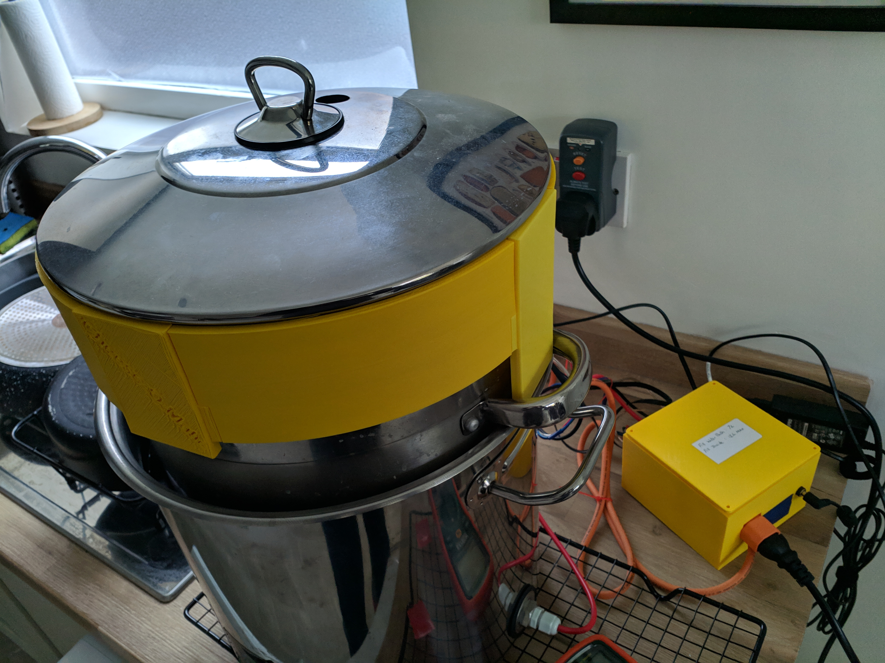
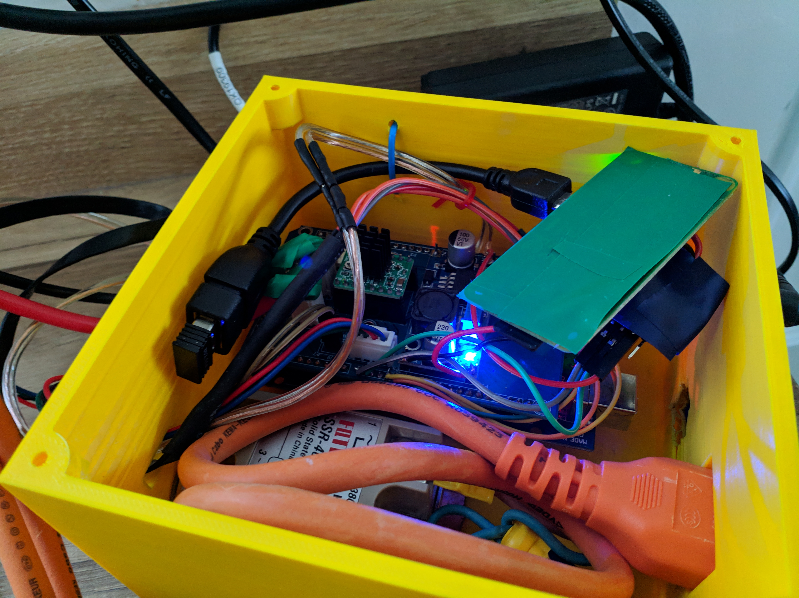
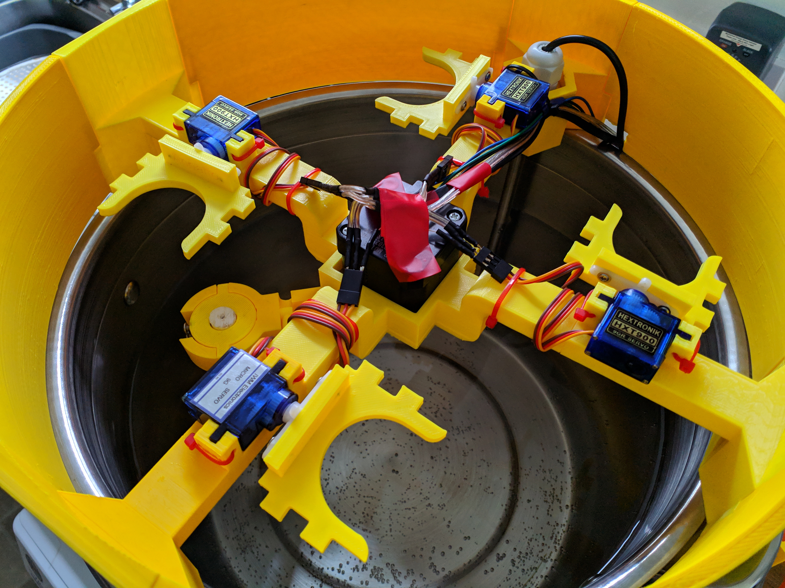
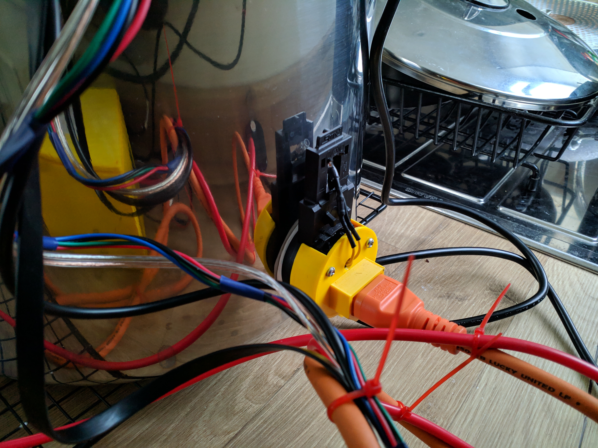
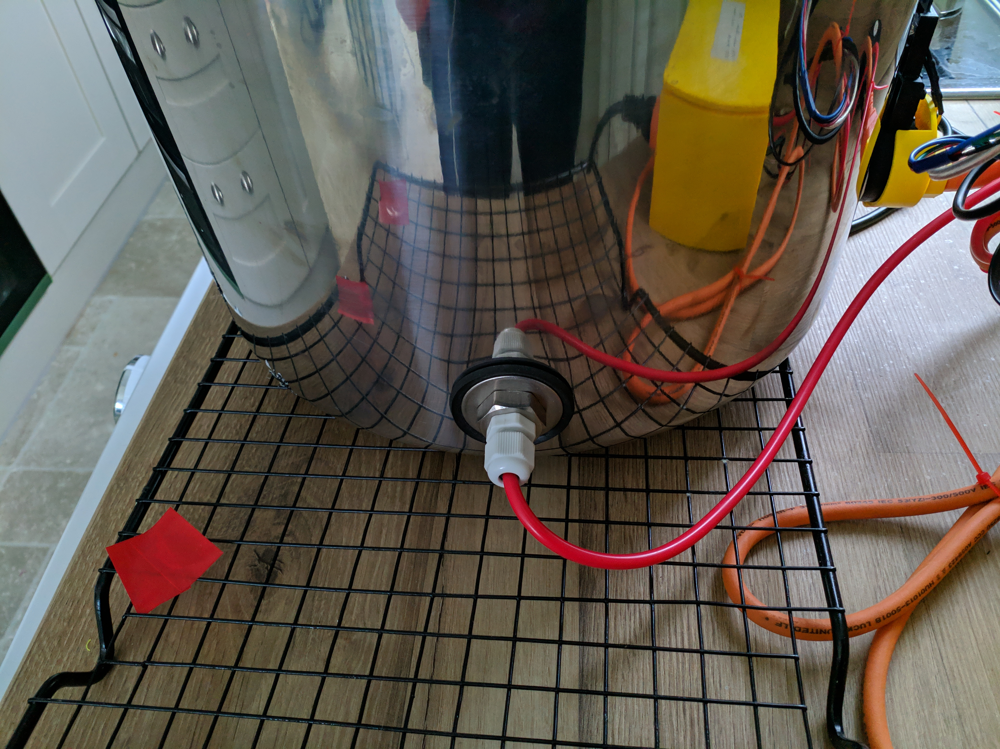
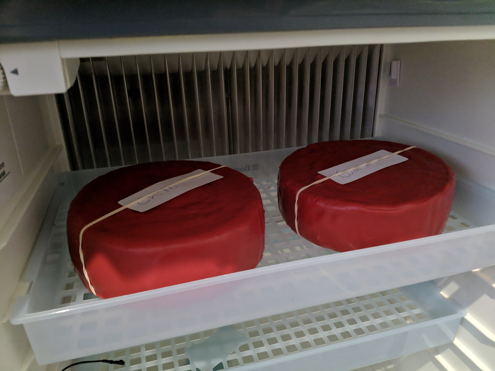

# Automatic Cheese Maker

## Intro
The Automatic Cheese Maker (ACM) is a tool to reduce the effort of making cheese, it has the following features:

- Heater (via a water bath)
- Stirrer (via a 3d printed stirrer and stepper)
- Ingredient releaser tool (via egg cups and servos)
- Digital recipe input to automate cheese making
- Web Based control UI
- Optional integration with Home Assistant

It reduces the initial effort for making cheese but does not do all of the job. The following are not performed by the ACM and have to be done by hand still:

- Curd Cutting
- Draining
- Pressing
- Aging/Drying/etc

## Pictures
Below are some images of the ACM in action.

## Cheeses Produced with ACM

## Parts

### WaterBath
The WaterBath part of the ACM is made using a similar method to the [brew kettle instructable](https://www.instructables.com/id/Build-Your-Own-Brewery-for-Under-100-STEP-2-/). You will need the following parts:

- [£6 Wilko kettle](https://www.wilko.com/en-uk/wilko-white-cordless-17l-kettle/p/0316169)
- [£20 Wilko 12L StockPot](https://www.wilko.com/en-uk/wilko-stock-pot-12l/p/0322498)
- [£26 21L StockPot](https://www.amazon.co.uk/gp/product/B07B9F4D6Q)
  - The above 21L StockPot has the following size: diameter 30 cm, height 30 cm
- [£4 DS18B20 Waterproof Digital Probe](https://www.ebay.co.uk/itm/DS18B20-Waterproof-Digital-Probe-Temperature-Sensor-Silicone-Cable-Thermometer/332222916282)
- [£4 1/2"NPT Thermowell 50mm length](https://www.ebay.co.uk/itm/Stainless-Steel-Thermowell-1-2-NPT-Threads-50-250-Temperature-Sensor-UULK-/264221201183)
- [£20 Aquarium pump](https://www.ebay.co.uk/itm/Sunbmersible-Water-Pump-Feature-Fish-Pond-Aquarium-Tank-Sump-Waterfall-Outdoor/124682149893?hash=item1d07a2a005:g:4ywAAOSwQdhgeANN)

You will also need to print the [KettleElementCap](https://github.com/AutomaticCheeseMaker/CheeseMaker-3DParts)

### Stirrer/Ingredient releaser
The Stirrer part of the ACM is the 3D printed bit that sits on top of the pot and stirs and releases ingredients. The following parts are needed:

- [£4 DS18B20 Waterproof Digital Probe](https://www.ebay.co.uk/itm/DS18B20-Waterproof-Digital-Probe-Temperature-Sensor-Silicone-Cable-Thermometer/332222916282)
- £4 1/2"NPT Thermowell 250mm length
- £8 Nema 17 1.8° Stepper Motor
- £12 4x Tower Pro SG-90 SG90 9g Micro Servo
- [£6 4x Egg Cups](https://www.amazon.co.uk/gp/product/B001CN0S38/ref=ppx_yo_dt_b_asin_title_o00_s00?ie=UTF8&psc=1)
- [£5 Pulley GT2](https://www.ebay.co.uk/itm/Pulley-GT2-20-Tooth-For-Axle-5mm-Ideal-Motor-Nema-17-Printing-3D-CNC/174636725694)
- [£10 Food safe beer paddle](https://www.ebay.co.uk/itm/Long-Plastic-Beer-Paddle-24-60cm-for-mixing-Home-Brewing-P-P-UK/253980480856)
- Some rubber bands

You will also need to print [StirrerArm and StirrerHolder](https://github.com/AutomaticCheeseMaker/CheeseMaker-3DParts)

### Control Circuit
The software runs on an Arduino Mega and a machine capable of running OctoPrint (this could be a raspberry PI or a PC).

The software stack consists of:
- [(Optional) Home Assistant](https://www.home-assistant.io/)
- [(Optional) MQTT](https://mosquitto.org/)
- [OctoCheese Plugin](https://github.com/AutomaticCheeseMaker/OctoCheese)
- [OctoPrint/OctoPi](https://octoprint.org/)
- [Custom Marlin Firmware](https://github.com/AutomaticCheeseMaker/Marlin)

The hardware stack consists of:
- £8 Arduino Mega 2560
- [£20 Custom Circuit Board + Components](https://github.com/AutomaticCheeseMaker/CheeseMaker-Circuit)
- £5 Solid State Relay 220V AC Output, 5V DC Input
- [£6 IEC C15 Orange 3m Cable](https://www.ebay.co.uk/itm/Power-Extension-Cable-IEC-C14-Male-Plug-IEC-C15-Female-Socket-3m-3metre-ORANGE/202315430599)
- 24V Power Supply
- £20 Raspberry Pi Zero + accessories

You will also need to print [HardwareCase](https://github.com/AutomaticCheeseMaker/CheeseMaker-3DParts)
